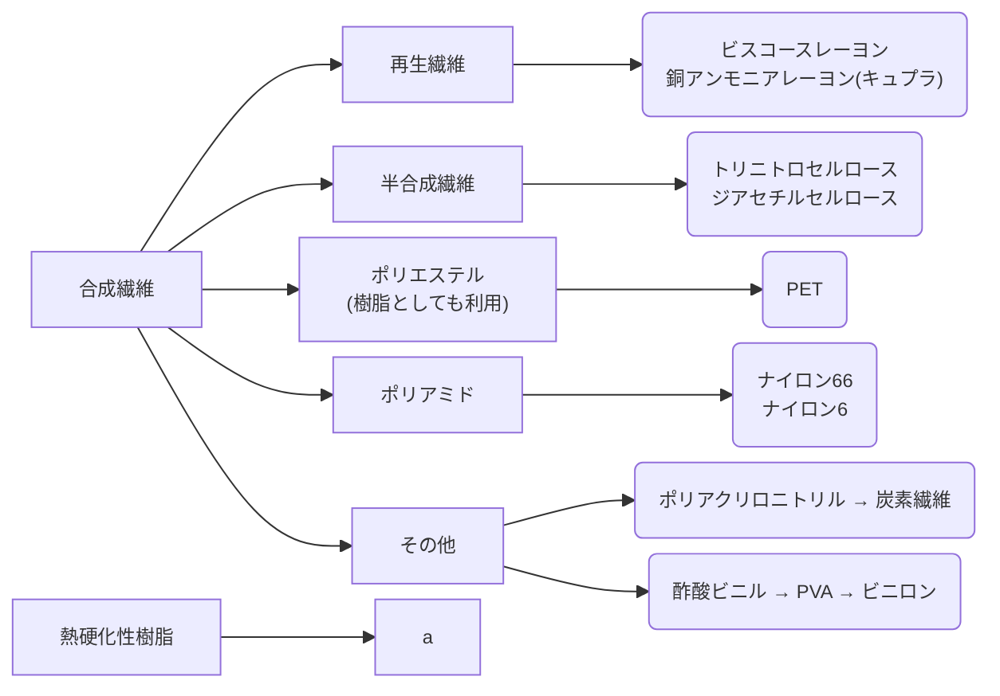

# 高分子

主に **合成繊維・熱可塑性樹脂・熱硬化性樹脂・ゴム系・機能性高分子化合物系** に分かれる。

高分子化合物は分子量が大きく、溶媒に溶けにくい。モル濃度が小さいので凝固点降下や沸点上昇での分子量の測定は向いていない。浸透圧は可能。

```mermaid
---
config:
    themeVariables:
        fontSize: 12px
    flowchart:
        nodeSpacing: 10
---

graph LR

a1[合成繊維] --> a2[再生繊維] --> a7("ビスコースレーヨン<br>銅アンモニアレーヨン(キュプラ)")
a1 --> a3[半合成繊維] --> a8("トリニトロセルロース<br>ジアセチルセルロース")
a1 --> a4["ポリエステル<br>(樹脂としても利用)"] --> a5("PET")
a1 --> a9[ポリアミド] --> a10("ナイロン66<br>ナイロン6")
a1 --> a11[その他] --> a12("ポリアクリロニトリル → 炭素繊維")
a11 --> a13("酢酸ビニル → PVA → ビニロン")

b1[熱硬化性樹脂] --> b2["a"]
```
