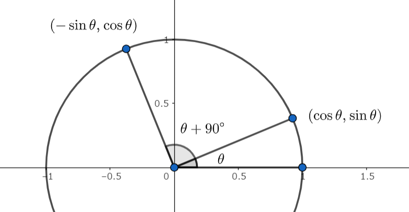

# 必ず覚えるもの一覧

自分が忘れがちなものを中心に書いています。「必ず」じゃないな～ってもの or 個人的に覚えたいだけのものには * が付いています。

## 幾何

三角形関連

+ 五心, チェバの定理・メネラウスの定理

+ 正弦定理 ... \\(2R = \dfrac{a}{\sin A} = \dfrac{b}{\sin B} = \dfrac{c}{\sin C} \~\Longleftrightarrow\~ \sin A = \dfrac{a}{2R}\\)

+ 余弦定理 ... \\(\displaystyle c^2 = a^2 + b^2 - 2ab\cos C \~\Longleftrightarrow\~ \cos C = \frac{a^2+b^2-c^2}{2ab} \\)

+ 三角形の面積 ... \\(\displaystyle S = \frac 12 ab\sin C = \frac 12 (a+b+c)r = \frac{abc}{4R}\\)

+ 三角形の面積2 ... \\(\displaystyle S = \frac 12 \\, (\boldsymbol{x} \times \boldsymbol{y}) = \frac 12 \sqrt{|\boldsymbol{x}|^2|\boldsymbol{y}|^2 - (\boldsymbol{xy})^2}\\)

+ *ヘロンの公式 ... \\(s = \dfrac{a+b+c}{2}\\) として \\(\displaystyle S = \sqrt{s(s-a)(s-b)(s-c)}\\)

+ \\(A + B + C = \pi\\) で成り立つ 和 \\(\longleftrightarrow\\) 半角積の公式
    - 「和 \\(\longleftrightarrow\\) 半角積が成り立つ」ってことだけ覚え、その場で導出する。

\\[
    \left\\{ \begin{align}
        \sin A + \sin B + \sin C &= 4\cos\dfrac A2 \cos\dfrac B2 \cos\dfrac C2 \\\\[8pt]
        \sin 2A + \sin 2B + \sin 2C &= 4\sin A \sin B \sin C \\\\[8pt]
        \cos A + \cos B + \cos C &= 4\sin\dfrac A2 \sin\dfrac B2 \sin\dfrac C2 + 1 \\\\[8pt]
        \cos 2A + \cos 2B + \cos 2C &= -4 \cos A \cos B \cos C - 1
    \end{align}\right.
\\]

+ Ravi 変換: \\(a = x+y,~ b = y+z,~ c = z+x\\) と変換したとき、三角形成立 \\(\Longleftrightarrow x,y,z > 0\\)

円関連

+ 方べきの定理

### とりあえず考えること

+ \\(R\\) が入っていたら正弦定理・三角形の面積

## 三角関数

「 \\(\sin, \cos, \tan\\) が表すもの」は単位円で覚えるのが無難で分かりやすいと思います。

補角・余角みたいな公式は覚えず、書いてみたときの長さ・符号で判断しています。

上の図でいうと「 \\(\cos(\theta + 90^\circ)\\) は絶対値が小さくて負の値だから \\(-\sin\theta\\) だな」って感じです。

---

オイラーの公式 \\(e^{i\theta} = (\cos\theta+i\sin\theta)\\) を知っておくと、心配になっても計算できる。

+ 加法定理 ... \\(
    \left\\{ \begin{array}{}
        \sin(\alpha \pm \beta) = \sin\alpha\cos\beta \pm \cos\alpha\sin\beta \\\\
        \cos(\alpha \pm \beta) = \cos\alpha\cos\beta \mp \sin\alpha\sin\beta \\\\
        \tan(\alpha \pm \beta) = \dfrac{\tan\alpha \pm \tan\beta}{1 \pm \tan\alpha\tan\beta}
    \end{array} \right.
\\)

+ 積和 ... 加法定理思い浮かべて作る。

+ 和積 ... \\(
    \left\\{ \begin{array}{}
        \sin(\alpha+\beta) + \sin(\alpha-\beta) = \sin\alpha\cos\beta \\\\
        \cos(\alpha+\beta) + \cos(\alpha-\beta) = \cos\alpha\cos\beta \\\\
    \end{array} \right.
\\) みたいな感じ。

+ 2倍角 ... \\(
    \left\\{ \begin{array}{}
        \sin 2x = 2\sin x \cos x = (\sin x + \cos x)^2 - 1 = 1 - (\sin x - \cos x)^2 \\\\
        \cos 2x = \cos^2x - \sin^2x = 2\cos^2x - 1 = 1 - 2\sin^2x
    \end{array} \right.
\\)

+ 3倍角 ... \\(
    \left\\{ \begin{array}{}
        \sin 3x = -4\sin^3 x + 3\sin x \\\\
        \cos 3x = 4\cos^3 x - 3\cos x
    \end{array} \right.
\\)

+ 半角 ... \\(\cos\\) の2倍角を思い浮かべる。

+ 合成 ... \\(a\sin\theta + b\cos\theta = (r\cos\alpha)\sin\theta + (r\sin\alpha)\cos\theta = r\sin(\theta+\alpha)\\)
    - ただし \\(r = \sqrt{a^2+b^2}, ~ \cos\alpha = a/r, ~ \sin\alpha = b/r\\) である。
    - 右辺が \\(\cos(\theta+\alpha)\\) にしたいときも同様に加法定理の形を思い浮かべる。

## 微積分
