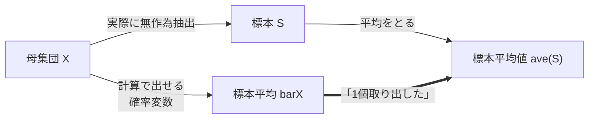

\\(
    \newcommand{\disp}{\displaystyle}
    \newcommand{\bar}[1]{\overline{#1}}
\\)

# 統計

## 確率変数とは

確率変数とは決まった確率で値を出力する**抽選機**のようなものであり、決まった実数値ではない。区別するために \\(X, Y, Z\\) と大文字で書かれる。

しかし、実数のように四則演算を定義することで表記を簡単にできる。確率変数と実数値の和・積について

> 確率変数 \\(X\\) が値 \\(x\\) を出すときに、かわりに \\(x+a, ~ x-a, ~ax, ~ x/a\\) を出したとみなす確率変数 \\(Y\\) を考えることができる。
>
> このとき、\\(Y = X+a, ~ X-a, ~ aX, ~ X/a\\) などと書くことにする。

と定義される。

## 離散確率変数

「確率リスト表」を作れるようなもの[^1]を**離散確率変数**という。

「離散確率変数 \\(X\\) について、ある値 \\(x_i\\) が出力される確率」を慣習的に \\(P[X = x_i]\\) と書いたりする。  
以下では、離散確率変数が明らかである文脈において \\(p_i\\) と書いたりすることにする。

このとき、期待値 \\(E[X] = m\\), 分散 \\(V[X]\\), 標準偏差 \\(\sigma[X]\\) は

\\[
    E[X] = \sum p_ix_i \\\\[10px]
    V[X] = \sum p_i(x_i - m)^2 \\\\[10px]
    \sigma[X] = \sqrt{V[X]}
\\]

と定義される。

[^1]: 正確には、像集合が高々可算無限集合であるもの。断りもなく値に自然数のラベルを付けていたり、シグマで和を取ったりしているのはよくないかも。

## 連続確率変数

// TODO: やる気ないなった。

確率密度関数 \\(f\\) や累積密度関数 \\(F\\)を用いて

\\[P[a \leq x \leq b] = \int_a^b f(x) ~ dx = F(b) - F(a)\\]

と表せる。この 2 つの関数は互いに微分・積分の関係にある:

\\[F(x) = \int_{-\infty}^x f(t) ~ dt \quad \Longleftrightarrow \quad F'(x) = f(x)\\]

## 二項分布

ある離散確率変数 \\(X\\) が、実数 \\(0 \leq p \leq 1\\) と自然数 \\(n\\) を用いて、\\(0 \leq k \leq n\\) について

\\[P[X = k] = \binom{n}{k} ~ p^k (1-p)^{n-k}\\]

が成り立つとき、「確率変数 \\(X\\) は二項分布 \\(B(n, p)\\) に従う」という。

\\(E = np,~ V = np(1-p),~ \sigma = \sqrt{np(1-p)}\\) となる。

\\(n\\) が十分大きいとき、正規分布 \\(N(np, np(1-p))\\) と近似することができる。

## 正規分布

良い性質を持った、自然界でよく見かける分布。平均 \\(m\\) と分散 \\(\sigma^2\\) を用いて正規分布 \\(N(m, \sigma^2)\\) と書く。

\\(N(0, 1)\\) である正規分布を特に**標準正規分布**という。普通の正規分布について

\\[X \sim N(m, \sigma^2) \quad \Longleftrightarrow \quad \frac{X-m}{\sigma} \sim N(0, 1)\\]

と変換することで標準正規分布に従わせることができる。これを**標準化**という。

 

標準正規分布表から、標準正規分布の累積密度関数 \\(F(x)\\) が分かる。

\\[
    F(x) = P\left[\frac{X-m}\sigma \leq x\right] = P[X \leq m + \sigma x]
\\]

であるから、正規分布から取り出した値が \\([m + p\sigma,~ m + q\sigma]\\) の範囲に含まれる確率は、

\\[
    P[m + p\sigma \leq X \leq m + q\sigma] = F(q) - F(p)
\\]

と計算することができる。

## 標本と標本平均

母集団を \\(X \sim N(m, \sigma^2)\\) とし、\\(n\\) 個抽出して標本を取ることを考える。このとき、標本の平均値は **標本平均** \\(\bar{X}\\) という確率変数から 1 個取り出したときの値と解釈できる。この標本平均について調べる。

母集団が \\(n\\) に対して十分大きいとき、非復元抽出でも復元抽出と見做せることが知られている。

母集団から復元抽出で \\(n\\) 回取り出した配列を出力する確率変数を \\(\mathrm{Rep}(n)\\) と書くことにする[^2]。特にそれぞれの試行は互いに独立で、\\(\bar{X} = \dfrac{\mathrm{Rep}(n)}{n}\\) である。

ここで、期待値・分散の独立な確率変数に対する加法性から

\\[
    E[\bar{X}] = E\left[\frac{\mathrm{Rep}(n)}{n}\right] = \frac{E[\mathrm{Rep}(n)]}{n} = \frac{nE[X]}{n} = m \\\\[25px]
    V[\bar{X}] = V\left[\frac{\mathrm{Rep}(n)}{n}\right] = \frac{V[\mathrm{Rep}(n)]}{n^2} = \frac{nV[X]}{n^2} = \frac{\sigma^2}{n} \\\\[25px]
    \sigma[\bar{X}] = \frac{\sigma}{\sqrt{n}}
\\]

と分かる。また、母集団が正規分布ならば標本平均も正規分布に従うことが知られている。

以上より、\\(\bar{X}\\) は標準偏差を \\(\sqrt{n}\\) で割った正規分布 \\(\disp N\left(m, \frac{\sigma^2}{n}\right)\\) に従うことが分かった。

[^2]: これは \\(nX\\) とは異なり、n 倍された値が取り出されるのではないことに注意。

## 母平均の推定・仮説検定

ある母平均から取り出した大きさ \\(n\\) の標本の平均・標準偏差が \\(\tilde{m}, \tilde{\sigma}\\) であったとする。
母集団が正規分布 \\(N(m, {\tilde{\sigma}}^2)\\) に従うと仮定したときの、未知な母平均 \\(m\\) はだいたいどの範囲に存在するかを考える。

このとき、**信頼度**という割合値を設定して推定する。今回はよく出題される 95% と設定する。これは「標本平均 \\(\bar{X}\\) の 95% 信頼区間に実際の標本平均値 \\(\tilde{m}\\) が含まれるような \\(m\\) 」の範囲を求めましょう、という意味である。

ここで、標準正規分布表から 95% 信頼区間は \\(\disp \left[m-1.96\frac{\tilde\sigma}{\sqrt{n}}, ~ m+1.96\frac{\tilde\sigma}{\sqrt{n}}\right]\\) と分かる。よって、

\\[
    m-1.96\frac{\tilde\sigma}{\sqrt{n}} \leq \tilde{m} \leq m+1.96\frac{\tilde\sigma}{\sqrt{n}} \\\\[10px]
    \Longleftrightarrow \tilde{m}-1.96\frac{\tilde\sigma}{\sqrt{n}} \leq m \leq \tilde{m}+1.96\frac{\tilde\sigma}{\sqrt{n}}
\\]

と推定できた。

 

次に仮説検定の話をする。そもそも仮説検定とは、調べづらい**対立仮説**に対して調べやすい**帰無仮説**を立て、帰無仮説が棄却できるかできないかを調べるというものである。

母平均の仮説検定では、対立仮説を「推定した母平均 \\(m\\) は正しくない」、帰無仮説を「母平均 \\(m\\) は正しい」とし、帰無仮説を仮定したときに実際の標本値が出てくる確率が小さすぎる場合に棄却する、というものである。

このときに設定する値を**有意水準**という。有意水準 5 %としたとき、標本平均の 95% 信頼区間に含まれるのかを調べる。

普通に標準正規分布表を見て調べれば終わり。

## 母比率の推定・仮説検定

母集団 \\(X\\) が確率 \\(p\\) で 1 を返す確率変数である、つまり二項分布 \\(B(1, p)\\) に従うとき、\\(p\\) を母比率という。同様に、標本のうち 1 である割合を標本比率という。

ここで、二項分布を大胆に

\\[\disp X \sim N(p, p(1-p)), ~ \bar{X} \sim N\left(p, \frac{p(1-p)}{n}\right) \\]

として母平均推定を行う。このとき標本の平均値はまさに標本比率を表す。よって、実際の標本比率を \\(\tilde{p}\\), 信頼度を 95% として

\\[
    \tilde{p} - 1.96 \sqrt{\frac{\tilde{p}(1-\tilde{p})}{n}} \leq p \leq \tilde{p} + 1.96 \sqrt{\frac{\tilde{p}(1-\tilde{p})}{n}}
\\]

を得る。\\(m = \tilde{p}, ~ \sigma = \sqrt{\tilde{p}(1-\tilde{p})}\\) としただけである。
